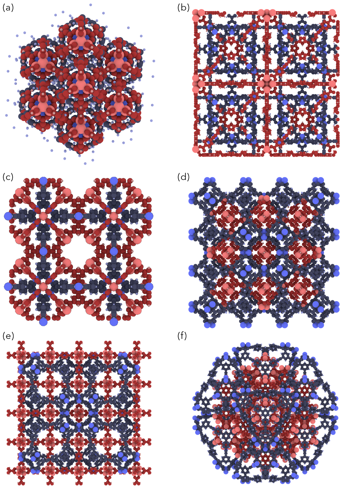
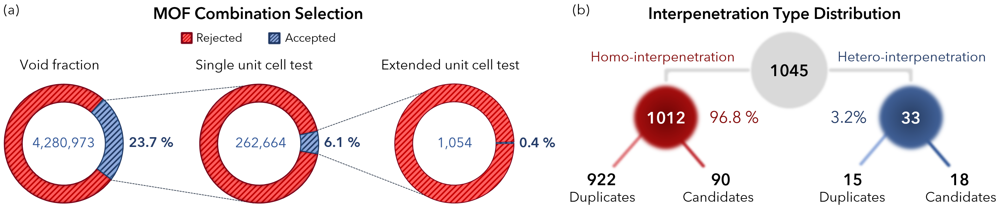
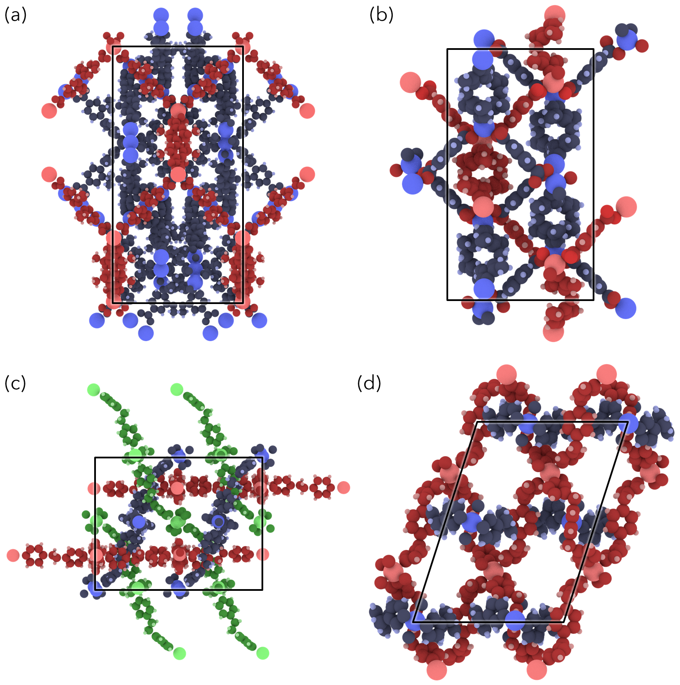

IPMOF Candidates
================

### Candidate interpenetrating MOFs

Here candiate interpenetrating structures discovered by running [IPMOF][IPMOF-ref] algorithm on [CoRE MOF database][CORE-ref] are provided. The cif files are separated in four groups as shown below:

#### Candidate Selection

-   Group 1: Hetero-interpenetarting candidates
-   Group 2: Hetero-interpenetrating duplicate structures (degenerate structures of group 1)
-   Group 3: Homo-interpenetrating duplicates (degenerate structures of group 4)
-   Group 4: Homo-interpenetrating candidates

#### Real Hetero-Interpenetrated MOFs

There are only a handful example of real hetero-interpenetrated MOFs however very complex and highly
interpenetrated structures have been successfully synthesized so far. It is interesting to understand
how this kind of coupling effects molecular properties.

Here are some rendered real hetero-interpenetrated MOF structures:

#### Reference

Sezginel, K. B., T. Feng, and C. E. Wilmer. "[Discovery of hypothetical hetero-interpenetrated MOFs with arbitrarily dissimilar topologies and unit cell shapes](http://pubs.rsc.org/en/content/articlelanding/2017/ce/c7ce00290d)." CrystEngComm 19.31 (2017): 4497-4504. DOI: 10.1039/c7ce00290d

[IPMOf-ref]: https://github.com/kbsezginel/IPMOF/
[CORE-ref]: http://pubs.acs.org/doi/abs/10.1021/cm502594j
